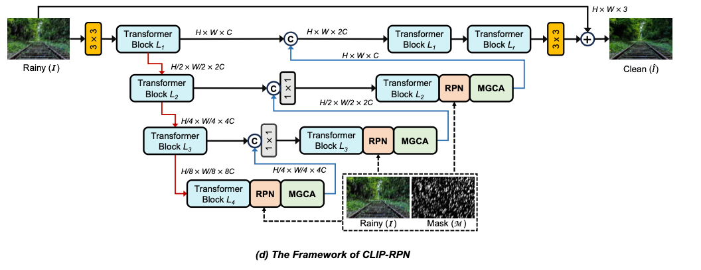
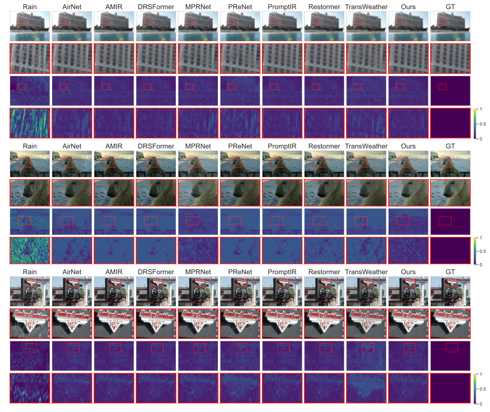

## 🌧️ CLIPRPN: 生成AI時代の新しい「雨」理解モデル

― マルチモーダルプロンプト学習による雨パターン認識と除雨 ―

近年、拡散モデルやCLIPに代表されるマルチモーダル学習の進化により、視覚と言語の統合理解が急速に発展しています。本研究「CLIPRPN（CLIP-based Rain Pattern Network）」は、この潮流を画像復元分野、特に画像除雨（Image Deraining）に応用した新しいアプローチです。

---

## 🧩 背景：単純な除雨から「理解する除雨」へ

従来の除雨モデルは、CNNやTransformerを用いて低レベルな特徴（輝度・エッジ・勾配）を抽出し、雨 streak の除去を目的としていました。しかし、こうしたモデルは「雨」の多様な形態 ― 霧状の雨、斜めの streak、水滴による散乱 ― を理解できず、テクスチャや構造の過補正を招く問題がありました。

CLIPRPN はこの問題に対し、「雨の物理的パターンを“認識”してから除去する」という新しいパラダイムを提案します。

---

## 🧠 モデル概要：CLIPによる雨パターン感知

本モデルは、OpenAI の CLIP（Contrastive Language–Image Pretraining） を基盤とし、画像とテキストのクロスモーダル表現を利用して、入力画像中の雨パターンを推定します。
	•	Rain Pattern Encoder（RPE）：CLIPの視覚エンコーダから特徴を抽出し、「雨」らしさを定量化。
	•	Prompt Generator（PG）：テキストプロンプトとして「霧状の雨」「斜めに降る雨」「レンズに付着した水滴」などの潜在的表現を生成。
	•	Deraining Network（DN）：推定された雨パターンを条件情報として活用し、構造保持型の除雨を実現。

このようにして、モデルは“画像に含まれる雨の意味”を理解し、単なるノイズ除去ではなく、コンテキストに基づいた除雨を実行します。

---

## 🔬 実験と結果

複数の実験（Rain100H、Rain200L、SPA-Dataなど）において、CLIPRPN は従来のSOTAモデル（MPRNet, DGUNet, Restormer等）を上回る性能を示しました。
	•	PSNR/SSIM が平均 +0.6〜1.2 向上
	•	視覚的に自然なディテール保持
	•	異なる雨タイプに対する一般化能力

さらに、モデルはゼロショット転移にも強く、未学習のデータセットでも安定した復元品質を維持しました。

---

🧭 意義と展望

CLIPRPN の最大の意義は、「高レベルな概念理解を低レベル復元タスクに導入」した点にあります。
今後は、雨だけでなく、雪・霧・夜間反射など他の気象劣化にも応用可能であり、ビデオ領域への拡張（時空間CLIP誘導）も期待されます。