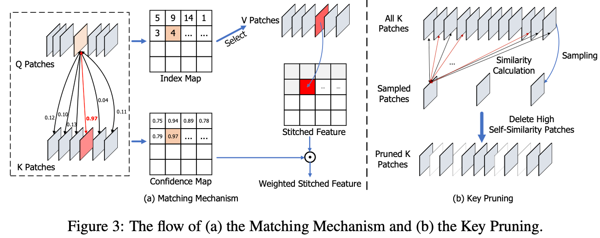
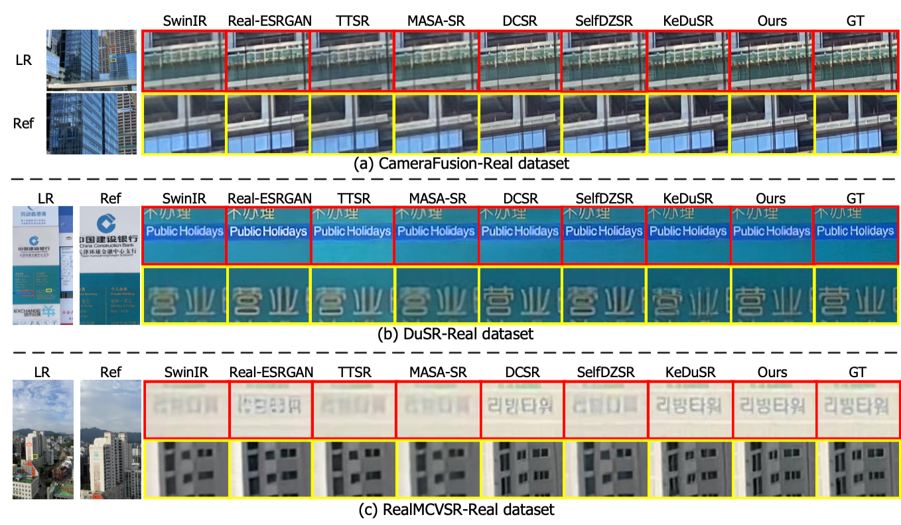
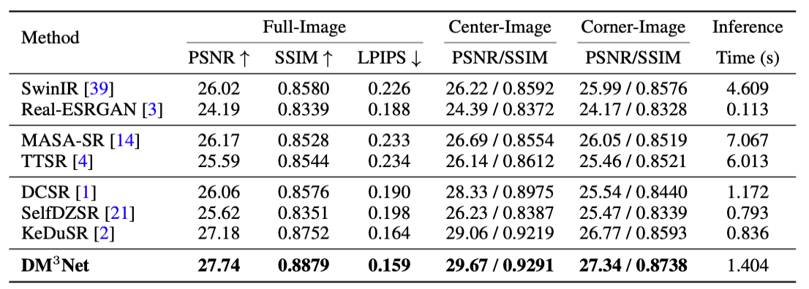


スマートフォンの複眼時代における新しい画像復元アプローチ


## 📱 概要

近年、スマートフォンやアクションカメラなどのマルチカメラデバイスは、広角と望遠といった異なる焦点距離の画像を同時に取得できるようになっています。

しかし、これらの画像には**視野（FoV）の不一致**や**解像度・色のドメイン差**が存在し、単純な画像融合では高精細な再構成が困難でした。


本研究で提案された **DM³Net**（Dual-camera SR via Domain Modulation and Multi-scale Matching）は、この課題に対して「多段階の特徴マッチング」と「グローバルなドメイン整合」を組み合わせることで、従来を凌駕する超解像性能を実現しました。


## 🔍 背景と課題

スマートフォンのデュアルカメラでは、
	•	広角カメラ：広い視野をカバーするが低解像度
	•	望遠カメラ：狭い視野ながら高解像度のディテールを含む

この望遠画像を「参照画像（Reference）」として利用し、広角画像を高精細化するのが**デュアルカメラ超解像（Dual-Camera SR）**の目的です。
従来の手法（例：DCSR, KeDuSR）はパッチ単位の特徴マッチングにより高周波情報を転送しますが、スケールの制約により細部再現性が低下する問題がありました 。

---

## 🧩 提案手法：DM³Net の主要構成

DM³Net は以下の3つの要素で構成されています。

1️⃣ Multi-Scale Matching（マルチスケールマッチング）

複数の受容野スケール（1/4, 1/2, 1）で特徴パッチの類似度を計算し、最適な参照パッチを選択。
これにより、従来のシングルスケールマッチングよりも構造整合性とディテール再現性を大幅に向上させました。

さらに、「Key Pruning」戦略を導入し、類似度の高い冗長パッチを削除。
GPUメモリ消費を約17%削減しつつ、推論時間を3分の1に短縮 。

2️⃣ Domain Modulation（ドメイン変調）

広角画像（LR）と望遠画像（Ref）は、異なる撮影パイプラインによりドメイン差が生じます。
そこで、DM³Net はそれぞれのペア（LR-GT, LRc-Ref）から**グローバルドメイン埋め込み（z, zgt）**を学習。
両者の分布を整合させる「ドメインアウェア損失（L_domain）」を導入し、再構成過程に適応的に組み込むことで、高解像ドメインへの滑らかな写像を実現しました。

3️⃣ Integrated Reconstruction（統合再構成）

最終的に、マッチングで再構成した高周波特徴と、ドメイン変調された埋め込み情報を統合し、視覚的に自然で高忠実度なHR画像を生成します。

---

## 🧪 実験結果

3つの実世界データセット（DuSR-Real, RealMCVSR-Real, CameraFusion-Real）において、DM³Netは以下の性能を達成：
 
特に非重複領域（Corner Region）においても高精度を維持し、部分的な視野差・色差に対しても頑健に動作することが確認されました 。

---

## ⚙️ アブレーションと考察
	•	マルチスケール化：スケールを増やすほどPSNRが向上（27.75 dB）。
	•	ドメイン変調：z と zgt を併用した場合が最良性能。
	•	Key Pruning：閾値0.7、サンプリング間隔16で最適バランス。

これらの結果から、DM³Net の性能向上は局所的マッチングの精度とグローバルドメイン整合の導入の両立によるものであると分析されています。

---

## 🌏 応用と展望

DM³Net は、スマートフォン・ドローン・車載カメラなど複数レンズを持つ撮影環境に直接応用可能です。
特に、ハードウェア間で異なる画角・解像度・ISP処理を統合する**計算写真技術（Computational Photography）**において高いポテンシャルを示しています。

今後は、モデル軽量化とリアルタイム化を目指し、Diffusion型復元や動画拡張への適用が期待されています。

 